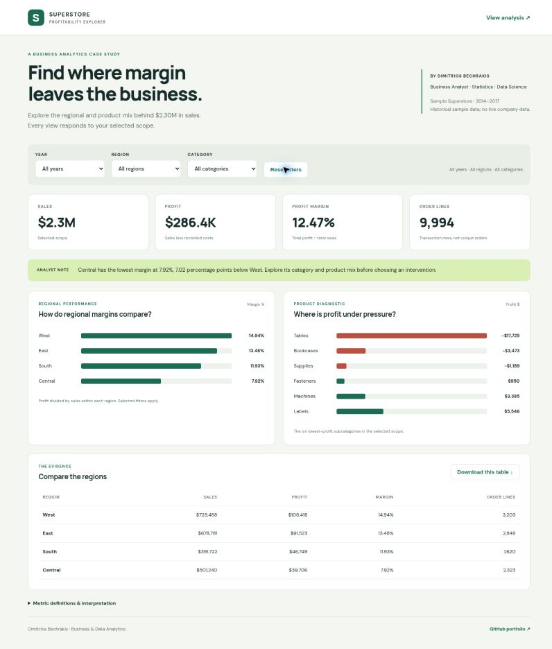
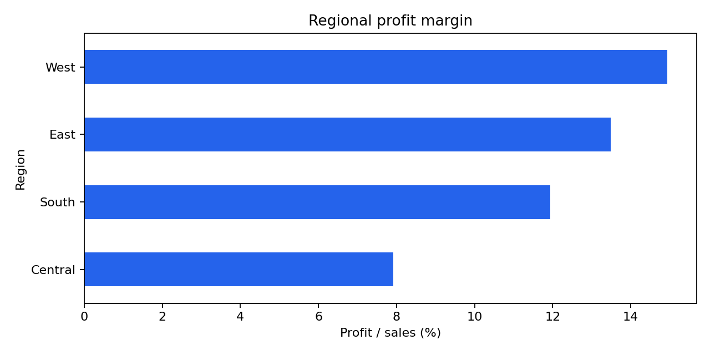

# Superstore — Regional Profitability & Shipping Analytics

A business intelligence case study using **Python, Power BI, DAX, and an interactive HTML dashboard** to identify regional profitability gaps and understand whether shipping or commercial factors explain performance differences.

## Interactive portfolio demo

**[Open the live Profitability Explorer →](https://dbechrakis-superstore.bechrakisd.chatgpt.site)**

Explore year, region and category filters, margin comparisons and a downloadable regional table. The demo uses aggregates from the committed sample CSV; it contains no customer identifiers.

Run locally with `python -m http.server 8000 --directory demo`, then open `http://localhost:8000`. Source: [`demo/`](demo/).

## Executive summary

The analysis examines sales, profit margin, dispatch performance, and product-level drivers across four US regions.

**Key finding:** Central is the clear profitability outlier, with a **7.92% margin versus 14.94% in West**. An exact, sales-weighted product decomposition shows that category and within-category product mix slightly *offset* Central's 7.02 percentage-point deficit; the gap is concentrated in lower margins within the same subcategories. Average order-to-ship time is broadly similar across regions. Pricing and discounting are commercial hypotheses worth investigating, not established causal drivers; these data do not measure delivery time or isolate logistics costs.

### What accounts for the Central–West margin gap?

| Component | Central − West (pp) |
|---|---:|
| Category mix | +0.273 |
| Subcategory mix within categories | +0.451 |
| Within-subcategory margin | **−7.747** |
| **Observed difference** | **−7.023** |

The largest negative within-product contributions are **Binders (−2.91 pp), Furnishings (−1.83 pp), Appliances (−1.71 pp), and Tables (−1.05 pp)**. Discounted lines (at least 30%) account for **25.76% of Central's realized sales versus 2.35% of West's**, but this association does not establish that discount cuts would recover the gap. Shipping-mode sales mix explains just **−0.11 pp** in a *separate, non-additive* mode-based view; within-mode margin differs by −6.91 pp and includes commercial effects. [Read the calculation and limitations](docs/margin-driver-method.md).

### Business implications

- Investigate recorded product economics and discount practices in Central, starting with Binders, Furnishings, Appliances and Tables.
- Separate the size of the regional margin gap from the potential impact of any proposed intervention.
- Keep monitoring Standard Class performance, but avoid treating shipping speed as the primary root cause without stronger evidence.
- Validate commercial interventions with controlled tests before scaling them.

## Business questions

- Which regions generate revenue efficiently, and where is margin leaking?
- Does shipping-mode mix differ materially by region?
- Are order-to-ship times consistent across regions and shipping modes?
- Where are Standard Class orders dispatched after five days concentrated?
- What operational and commercial explanations are supported by the data?

## Key metrics

| Metric | Result |
|---|---:|
| Sales | **$2.30M** |
| Profit | **$286.40K** |
| Overall margin | **12.47%** |
| Central margin | **7.92%** |
| West margin | **14.94%** |
| Standard Class | Dominant shipping mode |

## Analysis approach

1. Clean and type the transactional data.
2. Build order-to-ship and profitability measures.
3. Compare sales, profit, margin, and dispatch performance by region and shipping mode.
4. Investigate product and discount patterns behind regional margin differences.
5. Translate the evidence into business recommendations while separating correlation from causation.

## Deliverables

| Artifact | Purpose |
|---|---|
| [`Superstore_Sales.pbix`](dashboard/Superstore_Sales.pbix) | Power BI dashboard and data model |
| [`Superstore_Shipping_Regional_Analysis.ipynb`](notebooks/Superstore_Shipping_Regional_Analysis.ipynb) | Reproducible Python analysis |
| [`shipping_region_analysis.html`](docs/shipping_region_analysis.html) | Interactive HTML dashboard |
| [`Superstore_Sales_Report.docx`](docs/Superstore_Sales_Report.docx) | Detailed analysis and recommendations |
| [`margin-driver-method.md`](docs/margin-driver-method.md) | Reconciled Central–West decomposition, interpretation and limitations |

## Verified Python results

Recomputed from the committed source: **9,994 order lines, 5,009 distinct orders**, $2,297,200.86 sales and $286,397.02 profit. Standard Class orders dispatched after five days: Central **30.91%**, East **30.07%**, South **29.09%**, West **30.33%**. The denominator is distinct Standard Class orders in each region; five days is an analytical threshold, not a contractual SLA.

[Regional CSV](outputs/regional_metrics.csv) · [Dispatch CSV](outputs/standard_dispatch_metrics.csv) · [Source hash and totals](outputs/validation.json)

The new driver evidence is independently regenerated from that same source: [summary JSON](outputs/margin_drivers.json) · [product contributions](outputs/product_margin_contributions.csv) · [discount diagnostic](outputs/discount_diagnostic.csv) · [shipping-mode contributions](outputs/shipping_mode_contributions.csv). Both product and shipping views reconcile exactly to the margin gap but **must not be summed with each other**.

## My contribution and team credit

I contributed to the original group project with Alexandros Douvlidis and Fotios Fotakis and maintain this portfolio repository. The report records team membership but does not allocate individual tasks; this repository does not claim that I individually built every dashboard page or analysis. My current portfolio edition adds the verified Python companion, an interactive profitability explorer, a reproducible margin-driver investigation and automated evidence checks. These additions make the regional and dispatch metrics inspectable while preserving the original team credit.

## Dashboard

The Power BI report is structured around four analytical views:

- **Executive Summary** — headline KPIs and regional performance
- **Product Analysis** — product/category profitability and margin pressure
- **Customer Analysis** — customer and order-level patterns
- **Regional Performance** — shipping, margin, sales, and dispatch-time analysis

The model uses a dedicated DateTable, a measures table, calculated business flags, and DAX measures for sales, profit, margin, customers, orders, AOV, and dispatch performance.

## Tools

**Power BI · DAX · Power Query · Python · pandas · NumPy · matplotlib · HTML / JavaScript**

## Context

Portfolio case study based on a group Data Visualization project at **The American College of Greece**. The team context is retained for transparency; the repository is presented as a professional analytics case study rather than as a coursework archive.

## Reproduce the current metrics

Use Python 3.12, install `requirements.txt`, and run the Python notebook from its `notebooks/` directory. The source CSV is included; derived CSVs and charts are written to `outputs/`.

For the margin-driver investigation, run `python -m scripts.build_margin_drivers` from the repository root, followed by `python ci/verify_evidence.py` and `python -m unittest discover -s tests -v`. The new script uses only the Python standard library. Its output is a committed analytical companion to the notebook and archived dashboards, not a recalculation of those archived files.

The office documents, PBIX and HTML dashboard are **archived project deliverables**. Their embedded wording/metrics have not been refreshed in this review; the executed notebook, new driver script and exported evidence are the current reference for their respective analyses.

## Dataset

Sample Superstore transactional data, sourced from the dataset used in the original project.

## Author

**Dimitris Bechrakis**  
Business & Data Analyst | M.Sc. Data Science

## Licensing

See [licensing scope](LICENSING.md) for the MIT-licensed verification code and the separately governed project materials.
